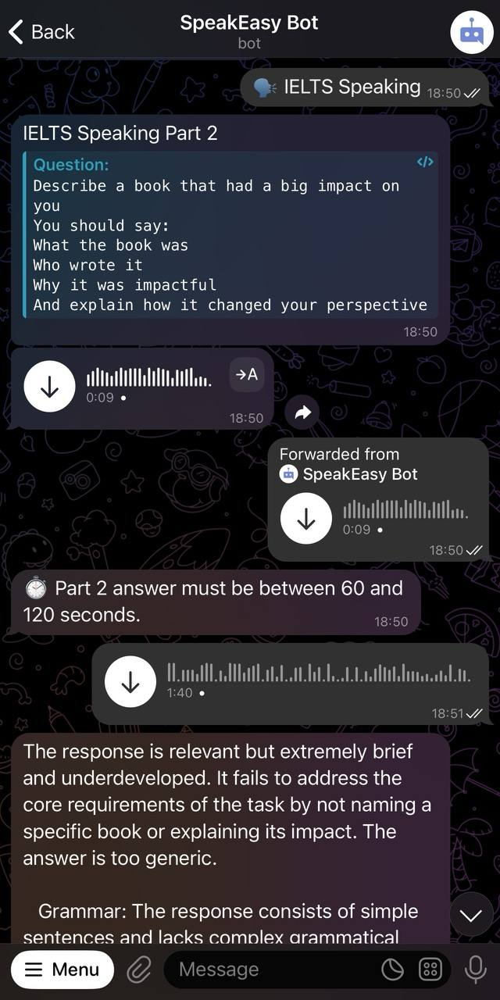
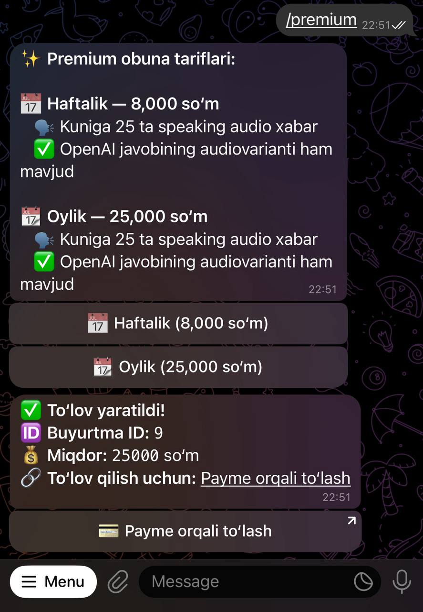
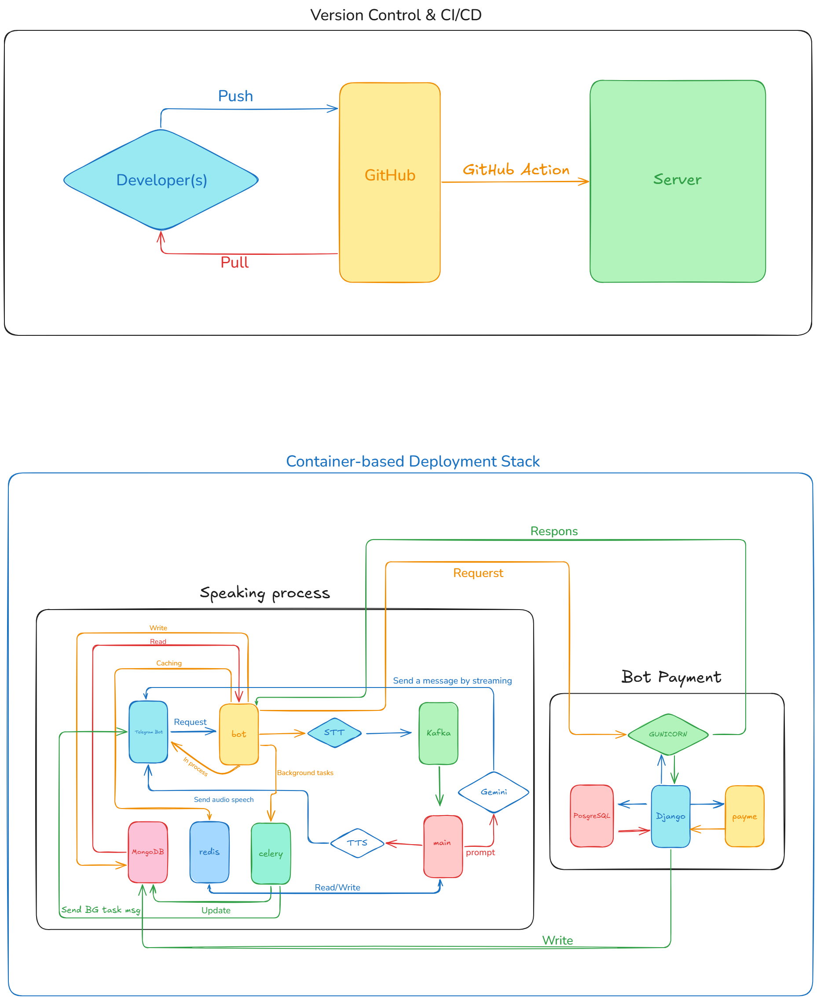
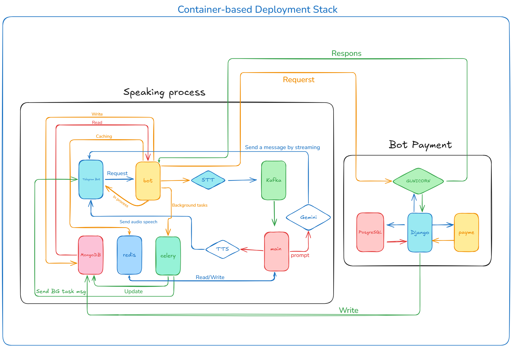
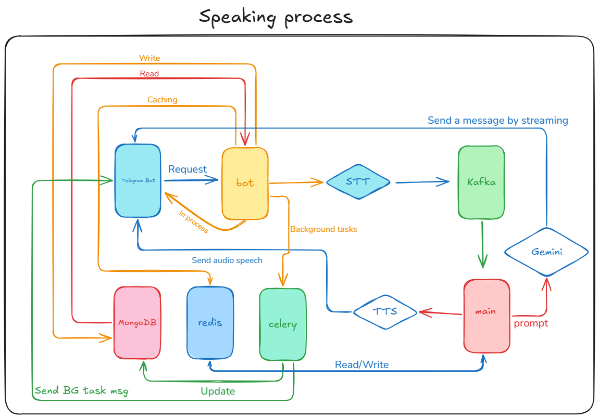
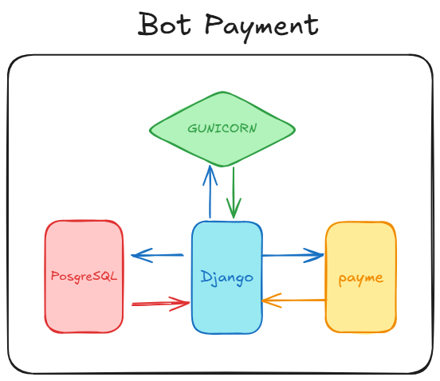

# 🗣️ SpeakEz.uz

**SpeakEz.uz** is a smart, AI-powered platform built to help users evaluate their **IELTS** or **MULTILEVEL** English **speaking** performance. Whether you're practicing for an exam or improving your communication skills, SpeakEz.uz provides fast, intelligent feedback based on your voice.

---

## 🚀 Features

- 💬 Assessments of spoken English responses
- 🧠 Intelligent AI-powered evaluations and suggestions
- 🐳 Seamless Docker-based deployment
- 📜 Detailed documentation with essential commands and guides

---

## 👥 Users at a Glance

- 👤 Total users: **3,500+**
- 💎 Premium users: **20+**
- 📈 Daily active users: **1,000+**

---

## 🖼️ Bot Screenshots

### ▶️ Start Screen


### 🎧 Speaking Mode


### 💳 Payment Screen


---

## 📆 System Architecture

### 📏 Full System Architecture


### 🚀 Microservice Architecture


### 🤖 Bot Architecture


### 💳 Payment Architecture


---

## 🚧 For Deployments

You can deploy **SpeakEz.uz** on various cloud platforms. Choose the one that fits your infrastructure needs:

- 🚀 [AWS EC2](https://aws.amazon.com/ec2/) for virtual machine-based hosting
- 📦 [AWS ECR](https://aws.amazon.com/ecr/) to manage and store Docker images
- ⚡ [AWS Lambda](https://aws.amazon.com/lambda/) for serverless deployments
- ☁️ [Google Cloud VMs](https://cloud.google.com/compute) for scalable hosting on GCP
- 🌐 [Azure Virtual Machines](https://azure.microsoft.com/en-us/services/virtual-machines/) for Microsoft Azure support

---

## ⚙️ Requirements

- Python **3.11**
- Docker & Docker Swarm installed
- Recommended: Virtual Environment (venv)

---

## 🛠️ Getting Started

Follow these steps to set up and run the project:

### 1. Clone the Repository
```bash
git clone https://github.com/username/speakez.git
cd speakez
```

### 2. Create and Activate a Virtual Environment
```bash
python3.11 -m venv venv
source venv/bin/activate
```

### 3. Install Dependencies
```bash
pip install -r requirements.txt
```

### 4. Set Up Environment Variables
```bash
cp .env.example .env
# Then edit the .env file to match your configuration
```

### 5. Run the App with Docker Compose
```bash
docker-compose --env-file .env up -d --build
```

---

## 🔗 Helpful Resources

- [Aiogram Official Docs](https://docs.aiogram.dev/en/latest/)
- [OpenAI API Reference](https://platform.openai.com/docs)
- [Google Cloud Speech-to-Text](https://cloud.google.com/speech-to-text)

---

## 📄 Command Cheatsheet

You can find useful commands in the `commands.txt` file to manage, debug, and deploy the project efficiently.

---

## 🤝 Contributions Welcome

Have ideas or want to help improve SpeakEz.uz? Open an issue, suggest new features, or submit a pull request. Your contributions are highly appreciated!

---

> Made with ❤️ by [Abdulaziz](https://t.me/abdulaziz9963)

